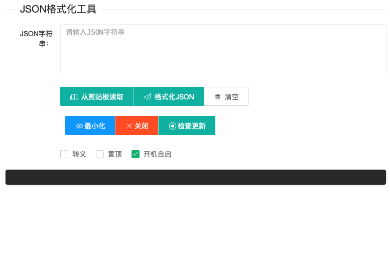

# JSON 格式化工具

<div align="center">


一个简单易用的 JSON 格式化工具，支持 JSON 验证、格式化和美化显示

[下载最新版本](https://github.com/scorpionfree98/json_reader/releases/latest) · [查看更新日志](CHANGELOG.md) · [报告问题](https://github.com/scorpionfree98/json_reader/issues)

</div>

## 功能特性

- JSON 格式化和美化显示
- JSON 语法验证
- 从剪贴板快速读取 JSON
- 语法高亮显示
- 支持折叠/展开 JSON 节点
- 窗口置顶功能
- 开机自启动
- 系统托盘支持
- 自动更新检测
- 跨平台支持（macOS、Windows）

## 截图



## 下载安装

### macOS

- **Intel (x64)**: [下载 DMG](https://github.com/scorpionfree98/json_reader/releases/latest/download/JSON%20格式化工具_latest_x64.dmg)
- **Apple Silicon (ARM64)**: [下载 DMG](https://github.com/scorpionfree98/json_reader/releases/latest/download/JSON%20格式化工具_latest_aarch64.dmg)


### Windows

- [下载安装程序](https://github.com/scorpionfree98/json_reader/releases/latest/download/JSON%20格式化工具_latest_x64-setup.exe)

## 使用说明

### 基本操作

1. **输入 JSON**
   - 在文本框中输入或粘贴 JSON 字符串
   - 点击"从剪贴板读取"按钮直接获取剪贴板内容

2. **格式化 JSON**
   - 点击"格式化JSON"按钮
   - 工具会自动验证 JSON 语法并美化显示

3. **清空内容**
   - 点击"清空"按钮清除所有内容

### 高级功能

- **转义**: 勾选"转义"复选框可以对 JSON 字符串进行转义处理
- **置顶**: 勾选"置顶"复选框将窗口保持在最前面
- **开机自启**: 勾选"开机自启"复选框实现开机自动启动
- **检查更新**: 点击"检查更新"按钮检测是否有新版本

### 窗口控制

- **最小化**: 点击"最小化"按钮将窗口最小化到托盘
- **关闭**: 点击"关闭"按钮退出应用
- **托盘菜单**: 右键点击系统托盘图标可以访问更多选项

## 开发指南

### 环境要求

- Node.js >= 20
- pnpm >= 8
- Rust (用于 Tauri)

### 安装依赖

```bash
pnpm install
```

### 开发模式

```bash
pnpm tauri:dev
```

### 构建应用

```bash
pnpm tauri:build
```

### 版本管理

```bash
# 更新补丁版本 (0.0.1 -> 0.0.2)
pnpm release:patch

# 更新次版本 (0.0.1 -> 0.1.0)
pnpm release:minor

# 更新主版本 (0.0.1 -> 1.0.0)
pnpm release:major
```

### 发布新版本

```bash
# 1. 更新版本号
pnpm release:patch

# 2. 提交更改
git add .
git commit -m "Release v1.0.0"

# 3. 创建并推送标签
git tag v1.0.0
git push origin v1.0.0
```

推送标签后会自动触发 GitHub Actions 构建和发布流程。

## 项目结构

```
json_reader/
├── src/                      # 前端源代码
│   ├── index.html           # 主页面
│   ├── main.ts              # 应用入口（窗口状态/更新/托盘/自启/剪贴板）
│   ├── utils/
│   │   └── jsonTool.ts      # JSON 处理工具
│   └── lib/
│       └── layui/           # Layui UI 框架
├── src-tauri/               # Tauri 后端代码
│   ├── Cargo.toml           # Rust 依赖配置
│   ├── tauri.conf.json      # Tauri 配置
│   └── icons/               # 应用图标
├── scripts/                 # 构建脚本
│   └── auto-version.js      # 版本同步脚本
└── .github/
    └── workflows/
        └── release.yml      # CI/CD 工作流
```

## 技术栈

- **前端**: HTML5, TypeScript, jQuery, Layui
- **后端**: Rust, Tauri v2
- **构建工具**: Vite, pnpm
- **CI/CD**: GitHub Actions

## 版本历史

### [最新版本](https://github.com/scorpionfree98/json_reader/releases/latest)

查看 [CHANGELOG.md](CHANGELOG.md) 获取完整的版本历史。

## 贡献指南

欢迎贡献代码！请遵循以下步骤：

1. Fork 本仓库
2. 创建特性分支 (`git checkout -b feature/AmazingFeature`)
3. 提交更改 (`git commit -m 'Add some AmazingFeature'`)
4. 推送到分支 (`git push origin feature/AmazingFeature`)
5. 开启 Pull Request

## 常见问题

### Q: 如何启用自动更新？

A: 自动更新已默认启用。应用启动时会自动检查更新，你也可以手动点击"检查更新"按钮。

### Q: macOS 提示"已损坏"怎么办？

A: 在终端中运行以下命令：
```bash
sudo xattr -rd com.apple.quarantine /Applications/JSON\ 格式化工具.app
```

### Q: 支持哪些平台？

A: 目前支持 macOS (Intel 和 Apple Silicon) 和 Windows (x64)。

## 许可证

本项目采用 MIT 许可证 - 详见 [LICENSE](LICENSE) 文件。

## 致谢

- [Tauri](https://tauri.app/) - 跨平台桌面应用框架
- [Layui](https://www.layui.com/) - 前端 UI 框架
- [jQuery](https://jquery.com/) - JavaScript 库

## 联系方式

- GitHub: [@scorpionfree98](https://github.com/scorpionfree98)
- 问题反馈: [Issues](https://github.com/scorpionfree98/json_reader/issues)

---

<div align="center">

**如果这个项目对你有帮助，请给一个 ⭐️ Star！**

Made with ❤️ by [scorpionfree98](https://github.com/scorpionfree98)

</div>
