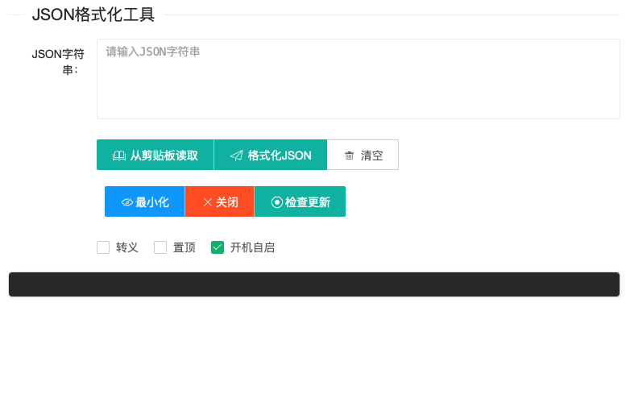

# JSON 格式化工具

<div align="center">


一个面向复杂 JSON 的跨平台桌面工作台，支持验证、格式化、树形浏览和富内容预览

[下载最新版本](https://github.com/scorpionfree98/json_reader/releases/latest) · [查看更新日志](CHANGELOG.md) · [报告问题](https://github.com/scorpionfree98/json_reader/issues)

</div>

## ✨ 功能特性

- 📋 **JSON 格式化和美化显示** - 自动格式化 JSON 字符串，使其更易读
- 🔍 **JSON 语法验证** - 实时检查 JSON 语法错误
- 🔎 **双视图搜索** - 支持大小写敏感、正则表达式和匹配导航
- 🧭 **编辑器与分屏模式** - 在高亮结果和左侧编辑、右侧树形浏览之间切换
- 📋 **从剪贴板快速读取 JSON** - 一键获取剪贴板中的 JSON 内容
- 🎨 **语法高亮显示** - 支持 JSON 语法高亮，提高可读性
- 📁 **支持折叠/展开 JSON 节点** - 方便查看大型 JSON 结构
- ⚡ **大型树分批加载** - 数组和对象按每批 500 项加载，避免一次创建全部节点
- 🧩 **JSON 文本解析** - 可解析最外层 JSON 字符串中的一层 JSON 内容
- 🖼️ **富内容预览** - 沙箱渲染字符串中的图片和表格，支持 Base64 图片悬浮预览
- 📋 **双击快速复制** - 双击 key 或 value 快速复制到剪贴板
- 📐 **LaTeX 公式渲染** - 支持渲染 JSON 字符串中的 LaTeX 数学公式
- 🌓 **白天/夜间主题** - 两个视图共享主题设置
- 📌 **窗口置顶功能** - 保持窗口在最前面，方便操作
- 🚀 **开机自启动** - 实现开机自动启动
- 📦 **系统托盘支持** - 从托盘显示/隐藏窗口并切换常用设置
- 🔄 **自动更新检测** - 自动检测新版本并提示更新
- 🌐 **跨平台支持** - 支持 macOS (Intel/Apple Silicon) 和 Windows

## 截图



## 📥 下载安装

### macOS

- **Intel (x64)**: [下载 DMG](https://github.com/scorpionfree98/json_reader/releases/latest/download/JSONFormatter_latest-macos-x64.dmg)
- **Apple Silicon (aarch64)**: [下载 DMG](https://github.com/scorpionfree98/json_reader/releases/latest/download/JSONFormatter_latest-macos-aarch64.dmg)

### Windows

- [下载安装程序 包含webview2（较大、兼容性好）](https://github.com/scorpionfree98/json_reader/releases/latest/download/JSONFormatter_latest-windows-x64-webview2.exe)
- [下载安装程序 较小，安装方便，适合系统自带webview2的情况](https://github.com/scorpionfree98/json_reader/releases/latest/download/JSONFormatter_latest-windows-x64.exe)

## 📖 使用说明

### 基本操作

1. **输入 JSON**
   - 在文本框中输入或粘贴 JSON 字符串
   - 点击"从剪贴板读取"按钮直接获取剪贴板内容

2. **格式化 JSON**
   - 点击"格式化JSON"按钮
   - 工具会自动验证 JSON 语法并美化显示

3. **清空内容**
   - 点击"清空"按钮清除所有内容

4. **切换分屏模式**
   - 左侧编辑原始 JSON，右侧实时展示树形结果
   - 拖动中间分割线可调整两侧宽度
   - 内容和选项会与编辑器模式同步

### 高级功能

- **双击复制**: 双击 JSON 中的 key 或 value 可以快速复制到剪贴板
  - 双击 key 复制完整的路径（如 `["user"]["name"]`）
  - 双击 value 复制值本身
  - 支持多种复制格式：
    - **默认格式**: `["user"]["name"]` 或 `["users"][0]["name"]`
    - **点号格式**: `user.name` 或 `users[0].name`
    - **JSONPath**: `$.user.name` 或 `$.users[0].name`
    - **方括号格式**: `['user']['name']` 或 `['users'][0]['name']`
    - **Python .get**: `.get('user').get('name')` 或 `.get('users')[0].get('name')`
    - **自定义格式**: 分别定义对象属性和数组索引的格式
      - 输入框默认显示占位符，可直接修改
      - 对象属性格式：使用 `key` 占位符（默认 `{key}`）
      - 数组索引格式：使用 `index` 占位符（默认 `{index}`）
      - 示例 1：对象属性 `.{key}`，数组索引 `[{index}]` → `.users[0].items[1]`
      - 示例 2：对象属性 `.get('{key}')`，数组索引 `[{index}]` → `.get('users')[0].get('items')[1]`
      - 示例 3：对象属性 `['{key}']`，数组索引 `[{index}]` → `['users'][0]['items'][1]`
- **LaTeX 公式渲染**: 勾选"转义"复选框可以渲染 JSON 字符串中的 LaTeX 数学公式
  - 支持行内公式 `$...$`
  - 支持块级公式 `$$...$$`
  - 例如：`"formula": "$E=mc^2$"` 会显示为数学公式
- **转义**: 勾选"转义"复选框可以对 JSON 字符串进行转义处理
- **JSON 文本（JSON Str）**: 仅当最外层 JSON 值本身是字符串时，再解析一次字符串内部的 JSON
  - 例如输入 `"{\"name\":\"Alice\"}"`，开启后会得到对象 `{ "name": "Alice" }`
  - 只解析最外层一次，不会递归解析普通对象字段里的 JSON 字符串
- **富内容**: 预览 JSON 字符串值中的 HTML 图片、表格和 Base64 图片
  - HTML 在无脚本权限的 sandbox iframe 中显示
  - 普通尖括号文本（例如 `<image>`）仍按文本显示
  - JSON 文本和富内容可以同时开启：先解析外层 JSON 文本，再预览内部图片或表格
- **置顶**: 勾选"置顶"复选框将窗口保持在最前面
- **开机自启**: 勾选"开机自启"复选框实现开机自动启动
- **检查更新**: 点击"检查更新"按钮检测是否有新版本

### 窗口控制

- **最小化**: 点击页面内"最小化"按钮最小化应用窗口
- **最大化**: Windows 使用窗口最大化；macOS 使用全屏切换，再次点击可还原
- **关闭**: 点击"关闭"按钮退出应用
- **托盘菜单**: 可显示/隐藏窗口、切换置顶和自启动、检查更新

## 🛠️ 开发指南

### 环境要求

- Node.js >= 20 且 < 26
- pnpm 10.32.1（由 `packageManager` 固定）
- Rust (用于 Tauri)

### 安装依赖

```bash
pnpm install
```

### 开发模式

```bash
pnpm tauri:dev
```

### 构建应用

```bash
pnpm tauri:build
```

### 测试与检查

```bash
# TypeScript 类型检查
pnpm exec tsc --noEmit

# 前端生产构建
pnpm build

# Rust 静态检查
cargo clippy --manifest-path src-tauri/Cargo.toml --all-targets -- -D warnings

# 真实 Tauri + WebDriver 端到端测试（当前 93 项）
pnpm test:tauri:e2e
```

Tauri E2E 需要 Node 20-25，并要求 `tauri-wd` 可从 `PATH` 访问。测试脚本会启动和清理 Vite、WebDriver 与 Tauri 进程；仅对已知的 WebDriver 插件锁故障自动重试一次。

### 版本管理

```bash
# 更新补丁版本 (0.0.1 -> 0.0.2)
pnpm release:patch

# 更新次版本 (0.0.1 -> 0.1.0)
pnpm release:minor

# 更新主版本 (0.0.1 -> 1.0.0)
pnpm release:major
```

### 发布新版本

```bash
# 1. 更新版本号（示例）
pnpm version:set 0.1.23

# 2. 提交更改
git add .
git commit -m "release: 发布 v0.1.23"

# 3. 创建并推送标签
git tag v0.1.23
git push origin tauri_dev_branch
git push origin v0.1.23
```

推送标签后会自动触发 GitHub Actions 构建和发布流程。

## 📁 项目结构

```
json_reader/
├── src/                      # 前端源代码
│   ├── index.html           # 主页面
│   ├── main.ts              # 应用入口（窗口状态/更新/托盘/自启/剪贴板）
│   ├── utils/
│   │   ├── jsonTool.ts      # 高亮 JSON 渲染与兼容入口
│   │   ├── treeRenderer.ts  # 分批树渲染与节点交互
│   │   ├── contentPreview.ts # HTML/Base64 富内容预览
│   │   ├── jsonPath.ts      # 路径解析和复制格式
│   │   ├── jsonError.ts     # JSON 错误定位与上下文
│   │   ├── latexRenderer.ts # LaTeX 渲染
│   │   ├── splitResizer.ts  # 分屏拖拽
│   │   └── windowController.ts # Tauri 窗口控制
│   └── lib/
│       └── layui/           # Layui UI 框架
├── src-tauri/               # Tauri 后端代码
│   ├── Cargo.toml           # Rust 依赖配置
│   ├── tauri.conf.json      # Tauri 配置
│   └── icons/               # 应用图标
├── scripts/                 # 构建脚本
│   ├── auto-version.js      # 版本同步脚本
│   └── run-tauri-e2e.mjs    # Tauri E2E 编排与清理
├── tests/                   # WebdriverIO 端到端测试与数据
└── .github/
    └── workflows/
        └── release.yml      # CI/CD 工作流
```

## 🛠️ 技术栈

- **前端**: HTML5, TypeScript, jQuery, Layui
- **后端**: Rust, Tauri v2
- **构建工具**: Vite, pnpm
- **CI/CD**: GitHub Actions

## 📝 版本历史

### [最新版本](https://github.com/scorpionfree98/json_reader/releases/latest)

查看 [CHANGELOG.md](CHANGELOG.md) 获取完整的版本历史。

## 🤝 贡献指南

欢迎贡献代码！请遵循以下步骤：

1. Fork 本仓库
2. 创建特性分支 (`git checkout -b feature/AmazingFeature`)
3. 提交更改 (`git commit -m 'Add some AmazingFeature'`)
4. 推送到分支 (`git push origin feature/AmazingFeature`)
5. 开启 Pull Request

## ❓ 常见问题

### Q: 如何启用自动更新？

A: 自动更新已默认启用。应用启动时会自动检查更新，你也可以手动点击"检查更新"按钮。

### Q: macOS 提示"已损坏"怎么办？

A: 在终端中运行以下命令：
```bash
sudo xattr -rd com.apple.quarantine /Applications/JSONFormatter.app
```

### Q: 支持哪些平台？

A: 目前支持 macOS (Intel 和 Apple Silicon) 和 Windows (x64)。

## 📄 许可证

本项目采用 MIT 许可证 - 详见 [LICENSE](LICENSE) 文件。

## 🙏 致谢

- [Tauri](https://tauri.app/) - 跨平台桌面应用框架
- [Layui](https://www.layui.com/) - 前端 UI 框架
- [jQuery](https://jquery.com/) - JavaScript 库

## 📞 联系方式

- GitHub: [@scorpionfree98](https://github.com/scorpionfree98)
- 问题反馈: [Issues](https://github.com/scorpionfree98/json_reader/issues)

---

<div align="center">

**如果这个项目对你有帮助，请给一个 ⭐️ Star！**

Made with ❤️ by [scorpionfree98](https://github.com/scorpionfree98)

</div>
